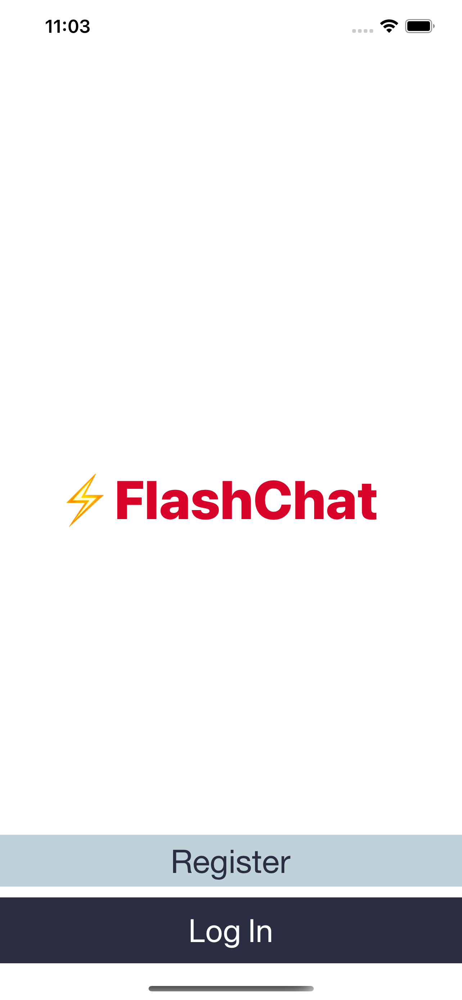
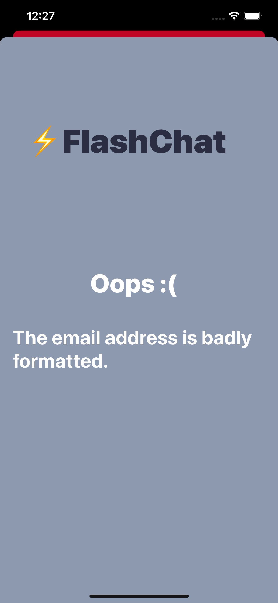
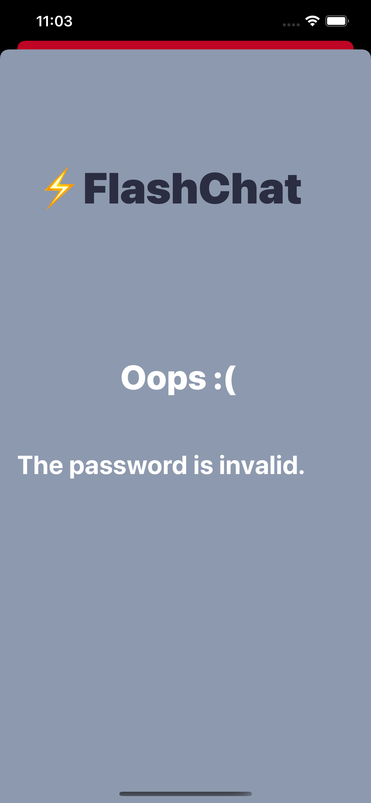
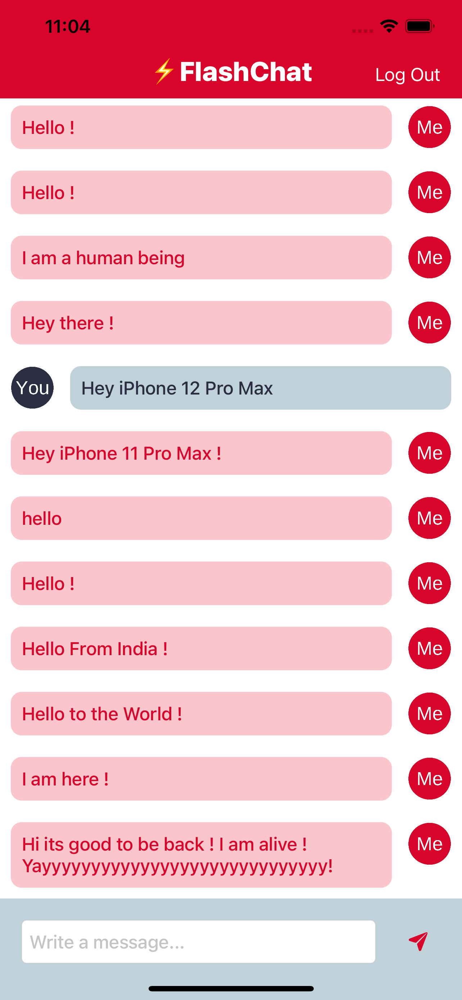

    

#  Flash Chat

## What is it ?

* Flash Chat is an internet based messaging app similar to WhatsApp. A Google service called Firebase Firestore is used as a backend database to store and retrieve the messages from the cloud. 
* Integrating third party libraries in the app using Cocoapods.
* Storing, Querying and Sorting Data in the cloud using Firebase Firestore.
* Using Firebase for user authentication, registration and login.
* Working with UITableViews and how to set their data sources and delegates.
* Creating custom views using .xib files to modify native design components.
* Creating direct Segues for navigation.

## App Screenshots

 |  (Home Screen) |  (Login Page) |  (Registration Page)|
 |:---:|:---:|:---:|
 
 | (Incorrect Email) | (Invalid Password) | (Chat Screen) | 
 |:---:|:---:|:---:|
 

